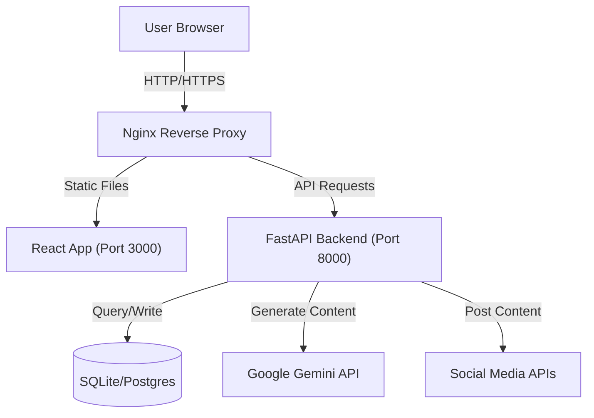

# ContentCaster - AI-Powered Social Media Automation Platform

**ContentCaster** (by Dossiefoyer Private Limited) is an enterprise-grade social media management dashboard designed to automate content creation, scheduling, and analytics using advanced AI agents (Gemini) and smart growth bots. It serves as a unified command center for all your social channels.


---

## 🚀 Tech Stack

### Frontend
- **Framework**: React 18
- **Build Tool**: Vite
- **Language**: TypeScript
- **Styling**: Tailwind CSS
- **Icons**: Lucide React
- **Charts**: Recharts
- **AI Integration**: Google Gemini SDK (`@google/genai`)

### Backend & Infrastructure
- **API**: FastAPI (Python)
- **Database**: SQLite / PostgreSQL (via SQLAlchemy)
- **Containerization**: Docker & Docker Compose
- **Server**: Nginx (Reverse Proxy recommended for production)

---

## 🏗️ Architecture

ContentCaster follows a modern client-server architecture designed for scalability and ease of deployment.



---

## 📱 Supported Platforms

ContentCaster is engineered to support multi-channel publishing across the most popular social networks.

| Platform | Type | Key Capabilities |
| :--- | :--- | :--- |
| **X (Twitter)** | Microblogging | • Thread creation & scheduling<br>• Reply automation via Engagement Bot<br>• **Visual Preview**: Accurate tweet rendering |
| **LinkedIn** | Professional | • Company Page & Personal Profile support<br>• **Formatting**: Professional formatting preservation |
| **Instagram** | Visual | • Direct publishing to Feed<br>• **Validation**: Aspect ratio warnings (1:1, 4:5)<br>• Feed Grid preview |
| **Threads** | Microblogging | • Seamless integration with Instagram ecosystem<br>• 500 character limit enforcement |
| **Facebook** | Social Network | • Page management<br>• Group posting<br>• Link preview customization |
| **YouTube** | Video | • **Video Support**: Title & Description fields<br>• Community Tab posts<br>• SEO tag generation via AI |
| **Discord** | Community | • Webhook integration for server announcements<br>• Rich Embed builder<br>• Automated role-based updates |

---

## ✨ Key Features

### 1. 📊 Dashboard Overview
- Real-time performance metrics (Reach, Engagement, Active Bots).
- Live activity logs streaming from backend bots.
- Weekly performance trend visualization.

### 2. 🎨 Creator Studio (Updated)
- **High-Fidelity Previews**: See exactly how posts look on Twitter vs. Instagram vs. LinkedIn before publishing.
- **Smart Tools**: Integrated **Emoji Picker** and **AI Hashtag Generator**.
- **Platform Validation**: Real-time character counting (e.g., 280 for Twitter) and media aspect ratio checks.
- **YouTube Support**: Dedicated fields for Video Titles.
- **Drafts & Duplication**: Save drafts or duplicate successful posts for A/B testing.
- **Powered by Gemini**: Generate high-converting posts tailored to specific platform tones.

### 3. 🤖 Bot Manager (Growth Engine)
- **Creator Bot**: Auto-generates and posts content based on trending topics.
- **Engagement Bot**: Smartly replies to comments and mentions.
- **Finder Bot**: Scrapes trends to feed the content engine.
- **Growth Bot**: Implements follow/unfollow strategies (configurable).

### 4. 📅 Content Calendar
- Drag-and-drop scheduling interface.
- **Unified Preview**: Editing a scheduled post shows the same high-fidelity preview as the Studio.
- Monthly view of all scheduled, published, and drafted posts.
- Conflict detection for high-frequency posting.

### 5. 📈 Advanced Analytics
- Platform-specific insights (Twitter vs LinkedIn vs Instagram).
- Growth charts for followers and impressions.
- **AI Insights**: Text-based analysis of what content performs best (e.g., "Reels are up 40%").

### 6. 🔗 Integrations (User-Specific)
- Users can link their own private social accounts.
- Supports OAuth flow simulation for Twitter, Facebook, LinkedIn, YouTube, etc.
- Isolated connection data per user.

### 7. 🖼️ Media Library
- **Batch Upload**: Drag-and-drop upload for multiple Images (JPG, PNG, WEBP) and Videos (MP4).
- **Smart Optimization**: Auto-crop/resize tools to generate "Story", "Square", or "Landscape" variants of assets.
- **File Management**: Metadata tracking (size, type, dimensions).

### 8. 👥 User Management & RBAC
- Role-Based Access Control: **Admin**, **Monitor**, **Viewer**.
- Invite system via email.
- User suspension/activation controls.

---

## 🛠️ Installation & Setup

### Prerequisites
- Node.js (v18+)
- Docker & Docker Compose
- Google Gemini API Key (get one at [aistudio.google.com](https://aistudio.google.com))

### Option A: Quick Start (Docker)

1. **Clone the repository**
   ```bash
   git clone https://github.com/yourusername/contentcaster.git
   cd contentcaster
   ```

2. **Configure Environment**
   Create a `.env` file in the root directory:
   ```env
   API_KEY=your_gemini_api_key_here
   VITE_API_URL=http://localhost:8000
   ```

3. **Run with Docker Compose**
   ```bash
   docker-compose up -d --build
   ```

4. **Access the App**
   - Frontend: `http://localhost:3000`
   - Backend API: `http://localhost:8000`

### Option B: Local Development

1. **Install Dependencies**
   ```bash
   npm install
   ```

2. **Start Development Server**
   ```bash
   npm run dev
   ```

---

## ⚙️ Configuration

The application supports a **Demo Mode** which is enabled by default. This allows you to explore all UI features without a running backend.

To switch to **Live Mode**:
1. Go to **Settings**.
2. Toggle "System Mode" to **Live Mode**.
3. Ensure your backend is running and `VITE_API_URL` is set correctly.

---

## 📂 Project Structure

```
contentcaster/
├── components/       # Reusable UI components (Sidebar, MediaPicker, PlatformIcon, etc.)
├── pages/            # Main application views (Overview, Studio, Calendar, etc.)
├── services/         # API calls and Mock Data store
├── types.ts          # TypeScript interfaces (Post, User, BotConfig)
├── App.tsx           # Main Router
├── index.html        # Entry HTML
├── vite.config.ts    # Vite Configuration
└── docker-compose.yml
```

---

## 🤝 Contributing

1. Fork the repository.
2. Create your feature branch (`git checkout -b feature/AmazingFeature`).
3. Commit your changes (`git commit -m 'Add some AmazingFeature'`).
4. Push to the branch (`git push origin feature/AmazingFeature`).
5. Open a Pull Request.

---

## 📝 License

Distributed under the MIT License. See `LICENSE` for more information.