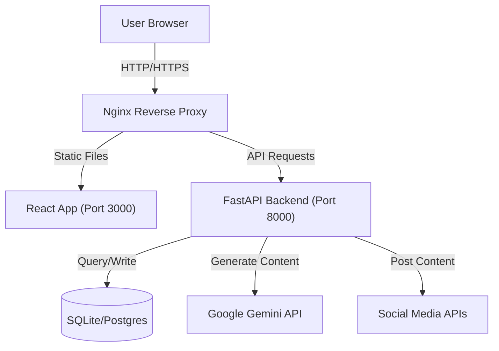

# ContentCaster - AI-Powered Social Media Automation Platform

**ContentCaster** (by Dossiefoyer Private Limited) is an enterprise-grade social media management dashboard designed to automate content creation, scheduling, and analytics using advanced AI agents (Gemini) and smart growth bots. It serves as a unified command center for all your social channels.


---

## 🚀 Tech Stack

### Frontend
- **Framework**: React 18
- **Build Tool**: Vite
- **Language**: TypeScript
- **Styling**: Tailwind CSS
- **Icons**: Lucide React
- **Charts**: Recharts
- **AI Integration**: Google GenAI SDK (`@google/genai`)

### Backend & Infrastructure
- **API**: FastAPI (Python)
- **Database**: SQLite / PostgreSQL (via SQLAlchemy)
- **Containerization**: Docker & Docker Compose
- **State Management**: Mock Store (LocalStorage) / REST API

---

## 🏗️ Architecture

ContentCaster follows a modern client-server architecture designed for scalability.



---

## 📱 Supported Platforms

ContentCaster is engineered to support multi-channel publishing with platform-specific validation.

| Platform | Type | Key Capabilities |
| :--- | :--- | :--- |
| **X (Twitter)** | Microblogging | • Thread creation & scheduling<br>• Reply automation via Engagement Bot<br>• **Visual Preview**: Accurate tweet rendering |
| **LinkedIn** | Professional | • Company Page & Personal Profile support<br>• **Formatting**: Professional formatting preservation |
| **Instagram** | Visual | • Direct publishing to Feed<br>• **Validation**: Aspect ratio warnings (1:1, 4:5)<br>• Feed Grid preview |
| **YouTube** | Video | • **Video Support**: Title & Description fields<br>• Custom Thumbnail upload<br>• SEO tag generation |
| **Threads** | Microblogging | • 500 character limit enforcement<br>• Cross-posting from Instagram |
| **Facebook** | Social Network | • Page management<br>• Group posting |

---

## ✨ Key Features

### 1. 🛡️ AI Trust & Safety Engine (Content Protection)
ContentCaster includes a built-in safety layer powered by Google Gemini to protect your brand reputation before any post goes live.
- **Violence & Physical Harm**: Detects and blocks content promoting violence, self-harm, or dangerous acts.
- **Hate Speech & Harassment**: Automatically flags discriminatory language or targeted harassment.
- **Content Protection**: Checks for potential policy violations (e.g., scams, clickbait, NSFW content).
- **Brand Safety**: Ensures tone consistency and prevents "PR disasters" by analyzing sentiment.

### 2. 📊 Dashboard Overview
- **Bento Grid Layout**: Real-time performance metrics (Reach, Engagement, Active Bots).
- **Live Activity Feed**: Streaming logs from backend automation agents.
- **Trend Detection**: AI analysis of viral topics to prompt immediate action.

### 3. 🎨 Creator Studio (Enhanced)
- **High-Fidelity Previews**: Pixel-perfect previews for Mobile/Desktop across all platforms.
- **AI Copilot**: 
  - Generates content based on Tone (Professional, Funny, Viral).
  - Auto-suggests viral hashtags based on content context.
  - "Auto-Fix" grammar and style.
- **Smart Validation**: Real-time checks for character limits, media types (e.g., Video required for YouTube), and aspect ratios.
- **YouTube Workflow**: Dedicated fields for Video Title and Thumbnail selection.

### 4. 🤖 Bot Manager (Autonomous Agents)
A full suite of configurable agents with granular control rules:

*   **Creator Bot**: Autonomous content engine.
    *   *Config*: Define Topics, Work Hours (9-5), Target Platforms, AI vs. Draft mode.
*   **Engagement Bot**: Community manager.
    *   *Config*: Reply to Mentions/Comments, Auto-Like hashtags, Daily interaction limits, Muted keywords.
*   **Finder Bot**: Trend scout.
    *   *Config*: Track Competitors, Monitor Keywords, Auto-save viral inspiration to drafts.
*   **Growth Bot**: Audience builder.
    *   *Config*: Follow strategies based on hashtags, Unfollow logic (e.g., after 7 days), Hourly safety throttles.

### 5. 📅 Content Calendar
- **Drag-and-Drop Scheduling**: Easily move posts to reschedule.
- **Views**: Toggle between Month Grid and Agenda List views.
- **Smart Filters**: Filter by Platform (e.g., show only LinkedIn posts) or Status (Draft/Scheduled/Published).
- **Timezone Awareness**: Multi-timezone scheduling support.

### 6. 📈 Advanced Analytics
- **Cross-Platform Metrics**: Compare growth across Twitter, LinkedIn, etc.
- **AI Insights**: Text-based analysis of performance (e.g., "Video content is performing 40% better on Tuesdays").
- **Engagement Heatmaps**: Visualize peak interaction times.

### 7. 🖼️ Media Library
- **Central Asset Repo**: Manage Images (JPG, PNG, WEBP) and Videos (MP4).
- **Details Inspector**: View metadata (Size, Dimensions, Date).
- **Video Preview**: Hover-to-play functionality for quick video scanning.
- **Optimization Tools**: Mock capability to crop/resize assets for specific platforms (Square/Story).

### 8. 👥 User Management (RBAC)
- **Role-Based Access**:
  - **Admin**: Full system control.
  - **Monitor**: Manage bots and view analytics (Read/Write limited).
  - **Viewer**: Read-only access.
- **Invite System**: Email invitation flow for onboarding team members.
- **Audit**: Track user status (Active/Suspended) and last active timestamps.

---

## 🛠️ Installation & Setup

### Prerequisites
- Node.js (v18+)
- Docker & Docker Compose
- Google Gemini API Key (get one at [aistudio.google.com](https://aistudio.google.com))

### Option A: Quick Start (Docker)

1. **Clone the repository**
   ```bash
   git clone https://github.com/dossiefoyer/contentcaster.git
   cd contentcaster
   ```

2. **Configure Environment**
   Create a `.env` file in the root directory:
   ```env
   API_KEY=your_gemini_api_key_here
   VITE_API_URL=http://localhost:8000
   ```

3. **Run with Docker Compose**
   ```bash
   docker-compose up -d --build
   ```

4. **Access the App**
   - Frontend: `http://localhost:3000`
   - Backend API: `http://localhost:8000`

### Option B: Local Development

1. **Install Dependencies**
   ```bash
   npm install
   ```

2. **Start Development Server**
   ```bash
   npm run dev
   ```

---

## ⚙️ Configuration

The application defaults to a **Simulation Mode** (Mock Store) for immediate testing without a backend database. Data persists to `localStorage`.

To switch to **Live Mode**:
1. Go to **Settings**.
2. Toggle "System Mode" to **Live Mode**.
3. Ensure your backend is running and `VITE_API_URL` is set correctly.

---

## 📂 Project Structure

```
contentcaster/
├── components/       # UI Components (Sidebar, MediaPicker, PlatformIcon, etc.)
├── pages/            # Page Views
│   ├── BotManager.tsx    # Agent Configuration & Logs
│   ├── CreatorStudio.tsx # Post Composer & AI Tools
│   ├── Analytics.tsx     # Charts & Graphs
│   ├── Calendar.tsx      # Drag-drop Schedule
│   └── ...
├── services/         # Logic Layer
│   ├── geminiService.ts  # AI Integration
│   ├── mockStore.ts      # Local State/Persistence
│   └── validationService.ts # Platform Rules
├── types.ts          # TypeScript Interfaces
├── App.tsx           # Router & Layout
└── docker-compose.yml
```

---

## 🤝 Contributing

1. Fork the repository.
2. Create your feature branch (`git checkout -b feature/AmazingFeature`).
3. Commit your changes (`git commit -m 'Add some AmazingFeature'`).
4. Push to the branch (`git push origin feature/AmazingFeature`).
5. Open a Pull Request.

---

## 📝 License

Distributed under the MIT License. See `LICENSE` for more information.
