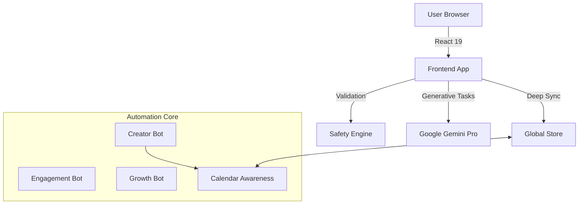

# ContentCaster - Enterprise AI Social Automation Platform

**ContentCaster** (by Dossiefoyer Private Limited) is the industry's most advanced social media command center. Unlike standard scheduling tools, ContentCaster employs **Autonomous AI Agents**, **Deep State Synchronization**, and **Context-Aware Scheduling** to manage high-volume social strategies with military precision.


---

## 🌟 Why ContentCaster? (Key Differentiators)

### 1. 🧠 Deep Sync™ Architecture
Most tools lose context when you switch between views. ContentCaster maintains a **Deep Sync** state.
- **Context Preservation**: Start editing in the Calendar, jump to the Creator Studio, and switch platforms without losing your draft, unsaved changes, or safety override settings.
- **Real-time State**: "Unsaved Changes" indicators track modifications across the entire session until committed to the database.

### 2. 📅 Intelligent Command Center (Calendar)
A calendar designed for power users and enterprise teams.
- **Dynamic Bulk Operations**: Select multiple posts to trigger a "Dynamic Island" floating toolbar.
  - **Mass Reschedule**: Shift entire campaigns to specific dates.
  - **Quick +7 Days**: Instantly push content to the next week (perfect for delaying campaigns).
  - **Bulk Pause**: Revert scheduled posts to drafts in one click.
  - **Platform Migration**: Bulk convert Twitter posts to LinkedIn posts instantly.
- **Visual Agenda**: High-density list view with status indicators, platform icons, and author tracking (Human vs. Bot).
- **Timezone Intelligence**: Auto-detects local system time vs. target audience timezone.

### 3. 🤖 Context-Aware Bot Swarm
Our bots don't just post; they *think* before they act.
- **Calendar Awareness**: Bots scan your existing calendar load before creating drafts. If a day is full (e.g., >3 posts), the bot holds back to prevent spamming.
- **Blackout Dates**: Define holidays, launch days, or crisis periods where bots automatically silence themselves.
- **Granular Strategy**:
  - **Creator Bot**: autonomous drafting based on brand voice (Professional, Viral, Empathetic).
  - **Engagement Bot**: Handles replies and likes with daily safety caps.
  - **Growth Bot**: Executes safe follow/unfollow strategies with cool-down periods.
- **Safety Throttling**: "Circuit breakers" stop bots immediately upon consecutive API errors or rate limits.

### 4. 🎨 Creator Studio Pro
- **A/B Testing (Variants)**: Generate and manage multiple text variants (Variant A, B, C) for a single post to test hooks.
- **Platform-Perfect Previews**: High-fidelity rendering for X (Twitter), Instagram (Grid & Carousel), LinkedIn, and YouTube.
- **AI Copilot**:
  - **Tone Shifting**: Rewrite content instantly (e.g., "Make it wittier", "Make it professional").
  - **Viral Hashtags**: Context-aware tag generation.
- **YouTube Workflow**: First-class support for Video Titles, Thumbnails, and Description formatting.

### 5. 🛡️ Trust & Safety Engine
An integrated AI layer that audits every keystroke before publication.
- **Compliance Checks**: Scans for hate speech, violence, NSFW content, and aggressive language.
- **Platform Policy**: Warns about character limits and aspect ratios (e.g., "Instagram images should be 1:1 or 4:5").
- **Safety Override**: Admins can explicitly bypass safety checks with audit logging.

---

## 🚀 Tech Stack

### Frontend
- **Framework**: React 19
- **Build Tool**: Vite
- **Language**: TypeScript
- **Styling**: Tailwind CSS (Glassmorphism & Apple-style aesthetics)
- **Icons**: Lucide React
- **Visualization**: Recharts
- **AI Integration**: Google GenAI SDK (`@google/genai`)

### Backend & Infrastructure
- **API**: FastAPI (Python) / Node.js
- **Database**: PostgreSQL / SQLite (Development)
- **Containerization**: Docker & Docker Compose
- **State Management**: Reactive Mock Store (simulating low-latency edge caching)

---

## 🏗️ Architecture



---

## 📱 Supported Platforms

| Platform | Type | Deep Features |
| :--- | :--- | :--- |
| **X (Twitter)** | Microblogging | • Thread visualization<br>• Reply automation<br>• Character count strict enforcement |
| **LinkedIn** | Professional | • Rich text formatting<br>• Document/PDF support readiness<br>• Corporate tone analysis |
| **Instagram** | Visual | • Carousel indicator support<br>• 1:1 / 4:5 Aspect Ratio validation<br>• Hashtag density optimization |
| **YouTube** | Video | • **Video Title & Thumbnail Management**<br>• Description SEO optimization<br>• Subscriber growth tracking |
| **Threads** | Microblogging | • Cross-posting capability<br>• 500-char limit checks |

---

## 🛠️ Installation & Setup

### Prerequisites
- Node.js (v18+)
- Docker & Docker Compose
- Google Gemini API Key

### Quick Start

1. **Clone the repository**
   ```bash
   git clone https://github.com/dossiefoyer/contentcaster.git
   cd contentcaster
   ```

2. **Configure Environment**
   Create a `.env` file:
   ```env
   API_KEY=your_gemini_api_key_here
   VITE_API_URL=http://localhost:8000
   ```

3. **Run Development Server**
   ```bash
   npm install
   npm run dev
   ```

---

## ⚙️ Configuration Guide

### Setting up Bots
1. Navigate to **Bot Manager**.
2. Select **Creator Bot** -> **Configure**.
3. **Calendar Tab**: Enable "Smart Scheduling" and set "Max Posts Per Day" to 3.
4. **Blackout Dates**: Add upcoming holidays to prevent auto-posting.
5. **Strategy Tab**: Set Creativity to "High" and Brand Voice to "Professional".

### Using Bulk Actions
1. Go to **Calendar** -> **Agenda View**.
2. Click checkboxes on multiple posts.
3. Use the **Floating Action Bar** to:
   - **Reschedule**: Move all to a specific date.
   - **+7 Days**: Delay the campaign by a week.
   - **Pause**: Revert all to drafts.

---

## 📂 Project Structure

```
contentcaster/
├── components/       # Reusable UI (PlatformIcon, MediaPicker)
├── pages/            # Core Modules
│   ├── BotManager.tsx    # Agent Configuration, Audit Logs, Calendar Awareness
│   ├── CreatorStudio.tsx # Editor, Deep Sync Logic, AI Generation
│   ├── Calendar.tsx      # Agenda/Month View, Bulk Actions
│   ├── Analytics.tsx     # Performance Metrics
│   └── ...
├── services/         # Business Logic
│   ├── geminiService.ts  # AI Prompts & Handling
│   ├── mockStore.ts      # State Persistence & Bot Simulation
│   └── validationService.ts # Platform Rules Engine
└── types.ts          # TypeScript Definitions (Strict Typing)
```

---

## 🤝 Contributing

We welcome enterprise partners and open-source contributors.
1. Fork the repository.
2. Create your feature branch (`git checkout -b feature/DeepSync`).
3. Commit your changes.
4. Open a Pull Request.

---

## 📝 License

**Dossiefoyer Private Limited**. Distributed under the MIT License.
