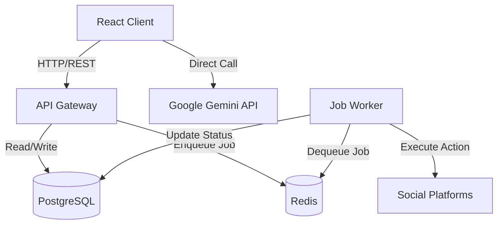

# System Architecture

## Overview

ContentCaster is built on a **Service-Oriented Frontend Architecture (SOFA)** backed by a scalable **Microservices** backend. It supports a unique **Hybrid Operation Mode**, allowing it to run entirely in the browser (Simulation Mode) for demos/testing or as a full-stack production application (Production Mode).

## 1. High-Level Diagram

## 2. Frontend Layer (The Studio)

Built with **React 19** and **Vite**, focusing on performance and fluid interactions.

*   **View Layer**: Components (`pages/`, `components/`) are purely presentational.
*   **Service Layer**: Business logic is isolated in `services/`.
    *   `mockStore.ts`: The central data orchestrator. It acts as a "Backend-in-a-Box" during simulation and a proxy to `api.ts` during production.
    *   `geminiService.ts`: Handles AI prompt engineering and interaction with Google's GenAI SDK.
    *   `validationService.ts`: Shared validation logic for platform constraints (character limits, media rules).
*   **State Management**: Uses a custom singleton pattern (`store`) rather than heavy libraries like Redux, optimizing for the specific needs of the "Deep Sync" feature.

## 3. Backend Layer (The Engine)

A Node.js/TypeScript stack designed for reliability and asynchronous processing.

*   **API Gateway (`backend/src/server.ts`)**:
    *   Express.js server.
    *   Handles CRUD operations for Posts, Users, and Bot configurations.
    *   Injects jobs into the Redis queue for asynchronous processing (e.g., scheduling a post for later).
*   **Worker Service (`backend/src/worker.ts`)**:
    *   Dedicated process for background tasks.
    *   **Post Executor**: Handles the actual logic of publishing to social platforms when a scheduled time arrives.
    *   **Bot Executor**: Runs autonomous agents (Engagement, Growth, Finder) based on configured intervals.
    *   Uses **BullMQ** for robust queue management (retries, delays, prioritization, dead letter queues).

## 4. Data Persistence

*   **PostgreSQL**: Primary source of truth for Users, Posts, Analytics, and Bot Configurations. Managed via **Prisma ORM**.
*   **Redis**: Used for:
    *   Job Queues (BullMQ).
    *   Caching (future implementation).
    *   Rate Limit storage.

## 5. Deployment Infrastructure

Containerized using **Docker** (`docker-compose.yml`).

*   **frontend**: Served via Vite (dev) or Nginx (prod).
*   **backend**: Node.js API container.
*   **worker**: Node.js Worker container (scales independently of the API).
*   **postgres**: Database container with persistent volume.
*   **redis**: Cache/Queue container.

## 6. Key Design Patterns

### Hybrid Mode Switch
The application checks `settings.demoMode` (defaulting to environment variables).
*   **Simulation Mode**: `mockStore` returns local JSON data, simulates network latency, and updates local state. No backend required.
*   **Production Mode**: `mockStore` delegates calls to `api.ts`, which makes real HTTP requests to the Backend API.

### Deep Sync™
Navigation between pages (e.g., Calendar -> Creator) passes state objects (dates, timezone, draft IDs) directly via props/navigation functions. This ensures context is preserved immediately without relying solely on URL query params or global context, providing a "native app" feel.

### Autonomous Bot Swarm
Bots are modeled as state machines (`Idle` -> `Running` -> `Cooldown` -> `LimitReached`).
1.  **Trigger**: Schedule (Cron) or Event.
2.  **Process**: Worker picks up job from Redis.
3.  **Action**: AI generation or Platform API call (simulated or real).
4.  **Log**: Execution result stored in `BotLogEntry` (visible in Bot Manager UI).
5.  **Feedback**: Stats updated, potential cooldown enforced if rate limits are hit.
